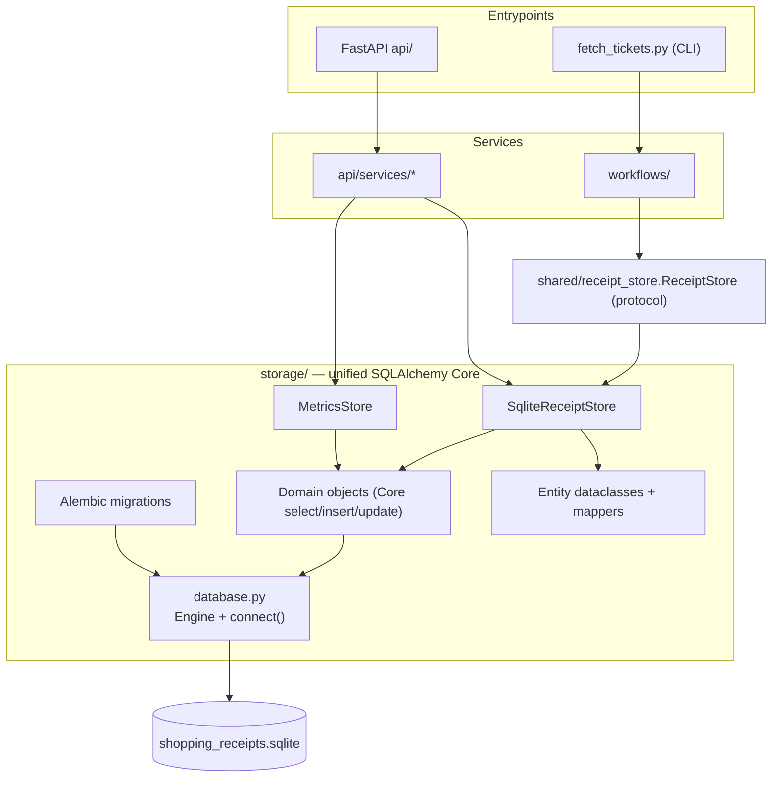

## Context

The persistence layer currently mixes two query styles inside the same module family:

- `storage/sqlite_domains.py` builds every entity query with PyPika (`SQLLiteQuery`, `Parameter("?")`).
- `storage/kpi_store.py` and parts of `storage/sqlite_receipt_store.py` compose raw SQL strings with f-strings and `WHERE 1=1` clause accumulation.

Schema evolution is handled by a self-written runner (`storage/sqlite_migration_runner.py`) that reads `V*.sql` files, tracks versions in a `schema_migration` table, and offers neither down migrations nor autogenerate.

Consumers are stable and must not change:

- Workflows (`workflows/`) call `SqliteReceiptStore` through the `shared/receipt_store.ReceiptStore` protocol (`find_existing_ids`, `persist_receipts`).
- API services (`api/services/kpi_service.py`, `receipt_service.py`) call `MetricsStore` and the static read methods on `SqliteReceiptStore`.
- `config/storage_config.SQLITE_RECEIPTS_DB_FILE` is the single DB path.

There are no existing ADRs in `<repo>/adr/`, so no in-force decisions constrain this design.

Target architecture (component-level, C4-inspired):

Boundaries: `storage/` is the only place that knows the database. Workflows and API services keep their current interfaces and DTOs. SQLite is a single container inside `storage/`; the Engine, domains, stores, and migrations are components of that one deployable unit.

## Goals / Non-Goals

**Goals:**

- One query technology (SQLAlchemy Core) for all write and read/analysis paths.
- Alembic-managed schema: baseline migration, ordered up migrations, down migrations, autogenerate support.
- A single SQLAlchemy `Engine` with `PRAGMA foreign_keys = ON` enforced on every connection.
- Preserve all public contracts: `ReceiptStore` protocol, `MetricsStore` method signatures, `SqliteReceiptStore` read-method signatures, result payloads, `PersistResult`.
- Keep the existing dataclass entities as the typed projection layer.
- SQLite-only; SQLite-specific SQL functions stay.

**Non-Goals:**

- No ORM / relationship mapper (SQLAlchemy ORM is not introduced).
- No Postgres or multi-dialect support.
- No in-place data migration of existing databases — they are rebuilt and receipts re-imported.
- No new KPI/receipt query features beyond the current behaviour.
- No changes to the API surface or frontend payloads.

## Decisions

### 1. SQLAlchemy Core (not ORM, not SQLModel, not raw SQL, not pypika)

Rationale: Core gives composable, parameterized expressions that express the analytical queries in `kpi_store.py` (dynamic `WHERE` filters, `GROUP BY`, `STRFTIME`/`group_concat` via `func`, pagination with `LIMIT/OFFSET`) without string composition. It keeps the existing dataclass projection layer intact (results map into entities), avoiding the ORM impedance with the hand-written schema.

Alternatives considered:

- *Full SQLAlchemy ORM*: adds relationship/unit-of-work machinery not needed here and would fight the hand-managed schema and dataclass mapping.
- *SQLModel*: couples models to Pydantic and the API layer; the codebase deliberately keeps DTOs separate from entities.
- *Raw SQL everywhere*: does not remove the fragility (f-string composition) that motivated this change.
- *Keep pypika*: no migration ecosystem, weaker analytical expressiveness, smaller community.

### 2. Alembic with a baseline migration, applied at startup

Alembic owns the schema. An initial `0001_initial_schema` revision recreates the current `V001__core_schema.sql` layout (tables `retailer`, `store`, `purchase`, `purchase_item`, `payment_method`, `purchase_lidl`, `purchase_rewe`, plus indexes and unique constraints). `database.py` runs `alembic upgrade head` when the engine is created, so a fresh DB is fully initialized on first use and existing DBs get pending migrations applied in order. Each migration has a working `downgrade()`. Future changes are generated with `alembic revision --autogenerate`.

The `schema_migration` table and the `V*.sql` files are retired.

### 3. Drop the hand-written cascade triggers; rely on PRAGMA foreign_keys

The triggers in `V001__core_schema.sql` exist as a fallback for tools that do not enable `PRAGMA foreign_keys`. With a single Engine, a SQLAlchemy `connect` event listener runs `PRAGMA foreign_keys = ON` on every connection, so `ON DELETE CASCADE` constraints are always active. The baseline migration therefore omits the triggers.

The update path keeps explicit child deletes (`_delete_purchase_children`) because `UPDATE` is used instead of `INSERT OR REPLACE` to avoid accidental cascade.

### 4. Preserve public interfaces and mapping layer

`SqliteReceiptStore` keeps the same method signatures and continues to implement `shared/receipt_store.ReceiptStore`. `MetricsStore` keeps the same KPI methods. Read helpers (`list_receipts`, `list_receipts_by_item`, `list_receipts_by_date_range`) keep their signatures and return the canonical receipt dictionaries.

Row-to-entity mapping is centralized in the existing `sqlite_entity_builders.py` plus small per-domain `_map_row` helpers; Core `RowMapping` values are converted with the same `None`/`float`/`str` handling as today.

### 5. Connection management via a small `database.py`

`storage/database.py` owns the lazily-created `Engine`, a `connect()` context manager (mirroring today's `closing(_connect_sqlite())` usage), and the startup migration call. Stores and domains obtain connections from it instead of calling `sqlite3.connect`.

### 6. SQLite-specific functions via `func`

`func.strftime`, `func.date`, and `func.group_concat` express the current KPI grouping. Because SQLite is the only target (decision in the proposal), no portability shims are needed.

## Risks / Trade-offs

- [Query behaviour drift while porting (STRFTIME formats, `GROUP_CONCAT(DISTINCT ...)`, weekday remap, Pfand exclusion)] → Mitigation: the 424 existing backend tests are the regression net; run `./.venv/bin/python -m pytest -q` after each ported module.
- [Alembic baseline diverges from the legacy schema, invalidating old DBs] → Mitigation: accepted by design (fresh rebuild). Documented in the migration plan; re-import is the recovery path.
- [External tooling that touched the DB without `PRAGMA foreign_keys` loses trigger-based cascade] → Mitigation: the project now owns a single Engine; any external access must enable foreign keys. Low impact for a single-user personal DB.
- [SQLAlchemy 2.0 API changes vs existing code knowledge] → Mitigation: pin `sqlalchemy>=2.0`; the Core API used here (`Table`, `select`, `insert`, `update`, `func`) is stable.
- [Alembic `autogenerate` drift against hand-written `Table` metadata] → Mitigation: keep the Core `Table` definitions in `sqlite_schema.py` as the single metadata source; autogenerate compares against that metadata only.

## Migration Plan

Deployment/rollout steps:

1. Add `sqlalchemy>=2.0` and `alembic>=1.13` to `requirements.txt`; remove `pypika`.
2. Introduce `storage/sqlite_schema.py` with Core `Table`/`MetaData` definitions for the current schema, and `storage/database.py` with the Engine, `connect()` context manager, and startup `alembic upgrade head`.
3. Set up `alembic/` (env.py wired to the metadata + engine URL); generate baseline migration `0001_initial_schema`; verify fresh-DB init.
4. Port `storage/sqlite_domains.py` to Core (same method signatures, mapped entities).
5. Port `storage/kpi_store.py` to Core (dynamic `.where()` filters, `func` aggregations, pagination).
6. Port `storage/sqlite_receipt_store.py` to the engine/connection context; convert remaining raw-SQL SELECT/DELETE to Core.
7. Delete `sqlite_migration_runner.py` and `sqlite_migrations/V001__core_schema.sql`; remove `pypika`.
8. Migrate storage tests to an in-memory SQLite engine (schema applied via Alembic head); replace raw-SQL fixtures in `tests/test_kpi_store.py`.
9. Delete the existing `shopping_receipts.sqlite` and re-import receipts (`fetch_tickets.py initial/update` flows).
10. Run the full backend test suite and the dashboard smoke check (`./start_backend.sh` + `curl http://localhost:8000/ui`).

Rollback: revert the code via git; the old DB file is discarded, so re-importing receipts is the recovery path (the receipt JSON sources remain the source of truth).

## Open Questions

- Keep the hand-written cascade triggers in the baseline schema as belt-and-braces, or drop them and rely solely on `PRAGMA foreign_keys = ON` (design assumes drop)? To be confirmed during implementation.
- Should `fetch_tickets.py` expose a dedicated `db reset` command that drops/recreates the schema and re-imports, or is manual DB deletion sufficient?
